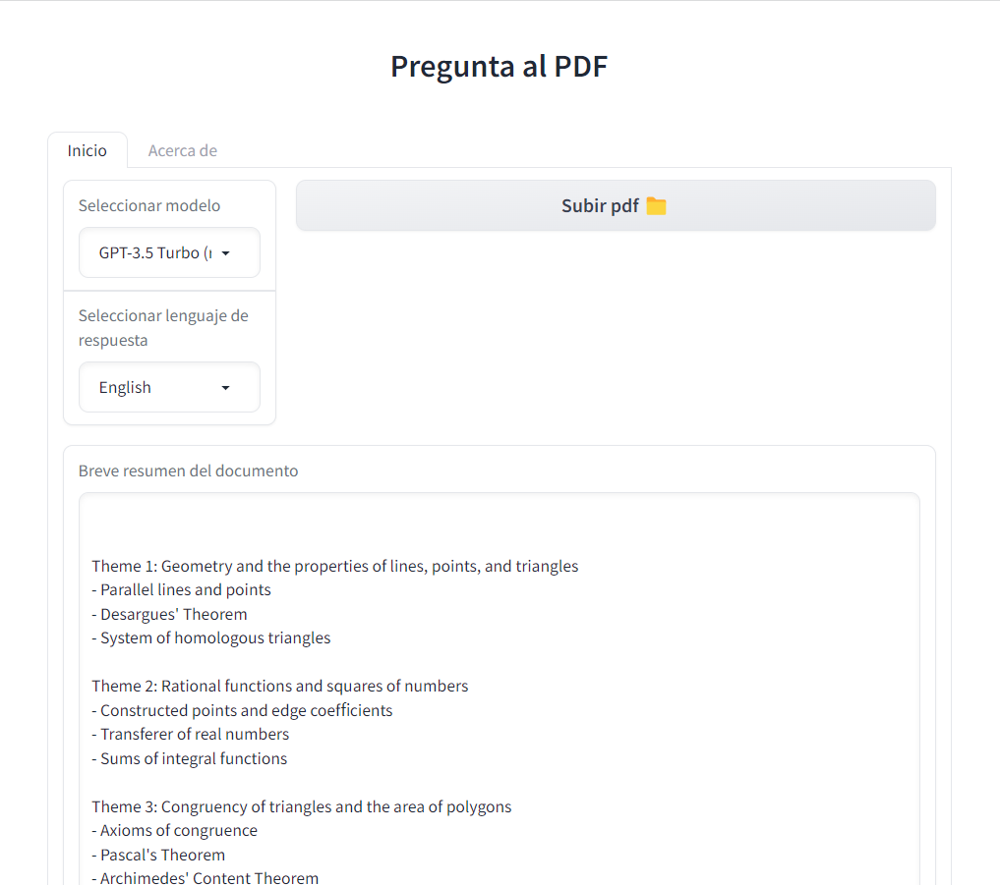
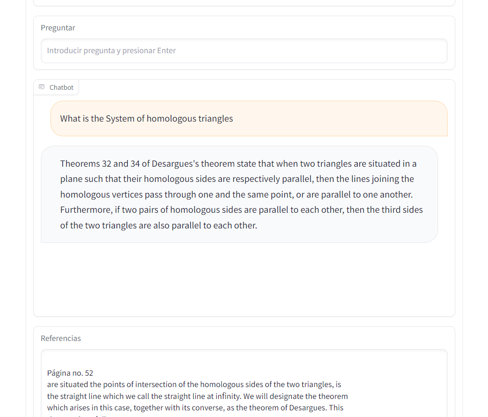

# Projects

## [Ask the PDF](https://github.com/a-jimenezc/pdf_chat)

* I developed a web application that allows users to upload a PDF document and, regardless of its size, initiate a question-and-answer process.
* It also generates a concise summary in a table-of-contents format as a guide and includes references to the text that the response was based on.
* It utilizes LLaMA 2 or gpt-3.5 Turbo as its language models.
* [**LangChain**](https://www.langchain.com/) served as the orchestration library for interfacing with the Large Language Models.
* [**Gradio**](https://www.gradio.app/) was used to create the user interface. The application was deployed using **Docker** and **Cloud Run**, Google's serverless service.
* While it was designed primarily for Spanish speakers, the application also supports responses in English.
* The app is accessible at **[pdf.dsapp.me](https://https://pdf.dsapp.me/)**

    

    

## [Plant Disease Detector](https://github.com/a-jimenezc/plant-disease-app/ "Click to access the repository")

* I built a web application that allows users to upload a photograph of a plant's leaves and, based on this, detect the type of leaf and the type of disease present. It has the capability to detect **13 species** of plants and up to **17 different diseases**.
* For this purpose, the object detection algorithm [**YOLOv7**](https://arxiv.org/abs/2207.02696) was used, along with the open-source implementation by [Wong Kin Yiu](https://github.com/WongKinYiu/yolov7). The algorithm is implemented in PyTorch, but inference is performed using the **ONNX** format.
* The web application was deployed using **Docker** and Google Cloud Platform's serverless service: Cloud Run.
* Link to the **[repository](https://github.com/a-jimenezc/plant-disease-app)** and the website: [**plant-disease.dsapp.me**](https://plant-disease.dsapp.me)
* The web application is intended for Spanish speakers.

    

    

## [Housing Price Predictor: Santa Cruz de la Sierra](https://github.com/a-jimenezc/bienes_raices_scz "Click to access the repository")

* I developed a housing price estimator  for the city of Santa Cruz de la Sierra. The model is made accessible through a Dash application: [realstate-scz.dsapp.me](https://realstate-scz.dsapp.me).
* **Web scraping** was used to extract data from real estate listing pages. Data preprocessing and exploratory analysis were also performed.
* Several regression models, including the **Gradient Boosting Regressor**, were trained, and their performance was evaluated using **R2** (coefficient of determination) as a metric.
* An interactive web page was implemented using **Dash**, **Docker**, and Google's **Cloud Run** service. On this page, users can estimate the price of a home.
* The same page features an **interactive dashboard** where it is possible to explore the data used in the model.
* **[Link to the repository](https://github.com/a-jimenezc/bienes_raices_scz "Click to access the repository")**
* The website is intended for Spanish speakers.

    

    

## [Customer Segmentation](https://github.com/a-jimenezc/segmentacion_de_clientes "Click to access the repository")

* Customers of a supermarket were segmented using information obtained from their membership cards, with the constraint of a limited number of segments. The [data](https://www.kaggle.com/datasets/dev0914sharma/customer-clustering) was obtainded from kaggle.
* Three different clustering algorithms were evaluated: **K-means, HDBSCAN,** and **Gaussian Mixture Model (GMM)**. The **Scikit-learn** library was used for K-means and GMM, while the **hdbscan** library was used for HDBSCAN.
* **Silhouette score, inertia**, and **BIC (Bayesian Information Criterion)** metrics were used to determine hyperparameters.
* The models' performance was then compared using the silhouette score, and the best-performing model was selected.

    

* The best model was **K-means** with four segments or clusters.
* Finally, a visual inspection of the results for the best model was performed, and the data was saved with a new label column.
* [Link to the repository](https://github.com/a-jimenezc/segmentacion_de_clientes "Click to access the repository")

     

# Publications

["Document Topic Extraction with Large Language Models (LLM) and the Latent Dirichlet Allocation (LDA) Algorithm"](https://towardsdatascience.com/document-topic-extraction-with-large-language-models-llm-and-the-latent-dirichlet-allocation-e4697e4dae87) - Published on Towards Data Science.

