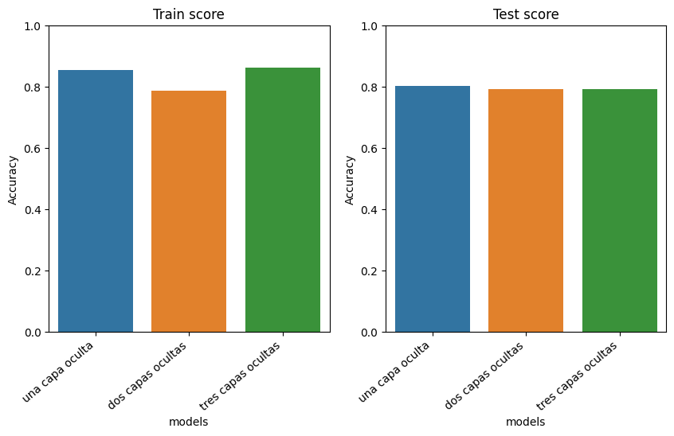
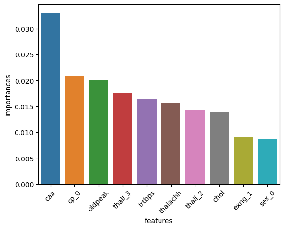

## [ Predicción de Enfermedad Cardiaca con Redes Neuronales](https://github.com/a-jimenezc/Prediccion_de_enfermedad_cardiaca "Clic para acceder al repositorio")

* El objetivo de este proyecto fue entrenar una Red Neuronal que permita predecir si un paciente presenta un cuadro de enferemedad de arterias coronarias.
* Para ello, se probaron tres variaciones del algoritmo MLP (Multilayer Perceptron): primero con una, luego con dos y finalmente con tres capas ocultas. En cada caso, se utilizó "Grid Seach" con "Cross-Validation" para seleccionar los hiperparámetros más óptimos. 
* Luego, se comparó el desempeño de los mejores modelos para cada variación del algoritmo y se seleccionó el mejor de ellos. 
* Finalmente, se aplicó la técnica de permutación para poder identificar las variables más importantes para el modelo y poder así interpretar el mismo.
* 

  

 
