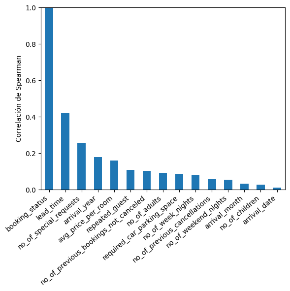
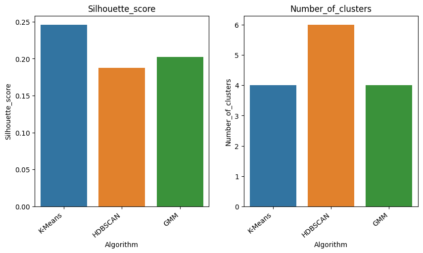
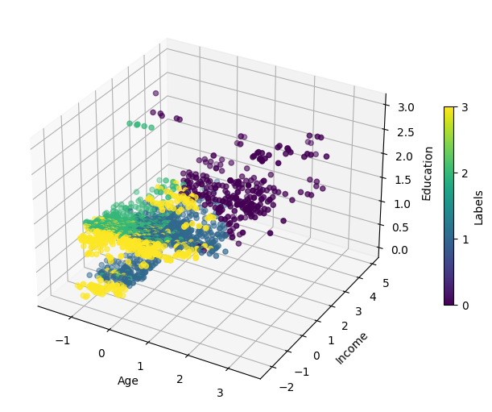
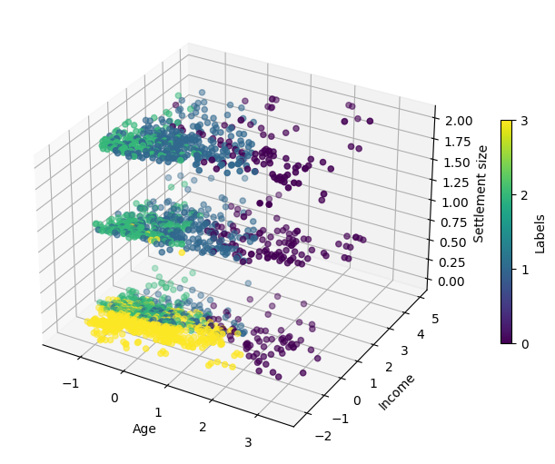

## [ Predicción de Cancelación de Reserva de Hotel](https://github.com/a-jimenezc/Prediccion_cancelacion_reserva_de_hotel "Clic para acceder al repositorio")

* El objetivo del presente trabajo es desarrollar un modelo que permita predecir si un cliente cancelará o no su reservación de hotel. Se prioriza la capacidad de predicción del modelo sobre la explicabilidad.
* En la exploración inicial de datos se identificaron las variables que guardan la mayor correlación con la variable objetivo. Dada la naturaleza binaria de la variable objetivo, se utilizó la correlación de Spearman.

* Se entrenaron cuatro modelos diferentes: *Logistic Regression, K-Nearest Neighbor, Extra Tree Classifier* y *Gradient Boosting*. En cada caso,  se determinaron los mejores hiperparámetros utilizando *Grid Search* con *Cross-Validation*. Para tal propósito, se usó la libreria Scikit-learn. Se utilizó la métrica *f1* como referencia para la búsqueda de los mejores hiperparmámetros.
* Se seleccionó el mejor algoritmo, tomando *f1* como métrica de comparación.  

* El algoritmo seleccionado es *Gradient Boosting*, con "learning_rate=1" y "n_estimators=600".
* Una vez entrenado este modelo, se puede ver que tiene un buen desempeño con las métricas *precision* y *recall* para ambas clases.

## [ Segmentación de Clientes](https://github.com/a-jimenezc/segmentacion_de_clientes "Clic para acceder al repositorio")

* El objetivo del presente trabajo es segmentar a los clientes de un supermercado en un número reducido de grupos, esto a partir de información obtenida a través de las tarjetas de membresía.
* Para ello, tres algoritmos de agrupamiento distintos fueron implementados: *K-means, HDBSCAN* y *Gaussian Mixture Model*. En cada caso,  se determinaron los mejores hiperparámetros. Se utilizó la libreria Scikit-learn para K-means y GMM, mientras que para el algoritmo *HDBSCAN* se utilizó la implementación provista por la libreria hdbscan. 
* Se usaron diversas métricas para determinar los hiperparámetros. Entre ellas está la métrica de la silueta, la inercia (elbow curve) y la métrica *BIC* (Bayesian Information Criterion). 
* Luego, se comparó el desempeño de los mejores modelos de cada algoritmo y se seleccionó el mejor de ellos. 

* Adicionalmente, se inspeccionó visualmente el resultado para el mejor modelo.
* Finalmente, se guardaron los datos con la nueva columna de etiquetas.

 

## [ Predicción de Enfermedad Cardiaca con Redes Neuronales](https://github.com/a-jimenezc/Prediccion_de_enfermedad_cardiaca "Clic para acceder al repositorio")

* El objetivo de este proyecto es entrenar una Red Neuronal que permita predecir si un paciente presenta un cuadro de enferemedad de arterias coronarias.
* Para ello, se probaron tres variaciones del algoritmo *MLP* (Multilayer Perceptron): primero con una, luego con dos y finalmente con tres capas ocultas. En cada caso, se utilizó *Grid Seach* con *Cross-Validation* para seleccionar los hiperparámetros más óptimos. 
* Luego, se comparó el desempeño de los mejores modelos para cada variación del algoritmo y se seleccionó el mejor de ellos. 
* Finalmente, se aplicó la técnica de permutación para poder identificar las variables más importantes para el modelo y poder así interpretar el mismo.

  
 
