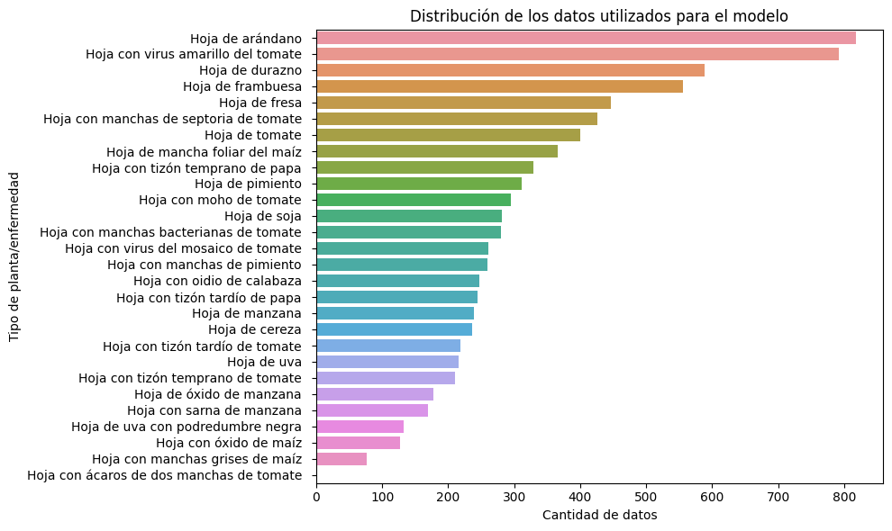
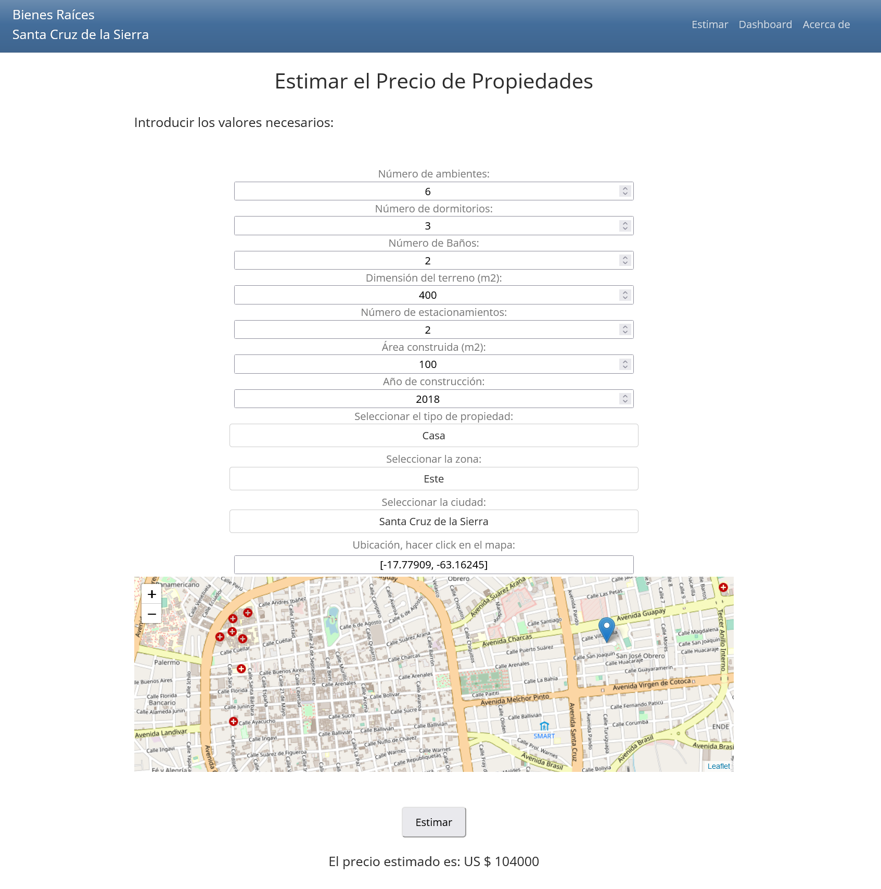
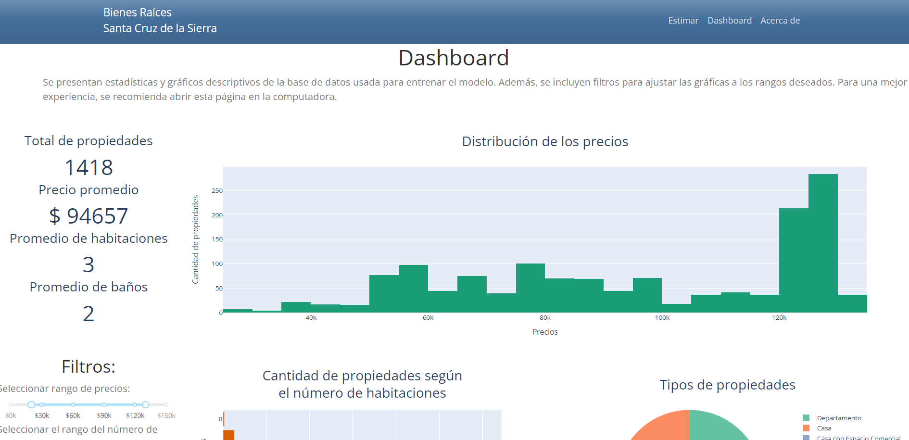
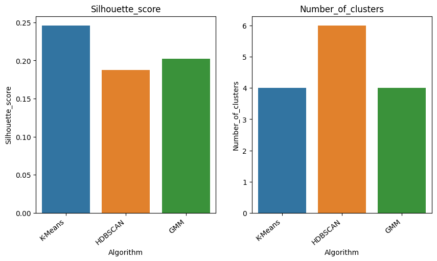
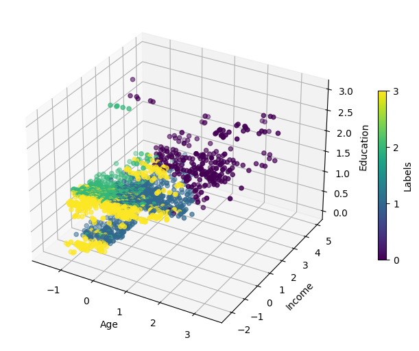
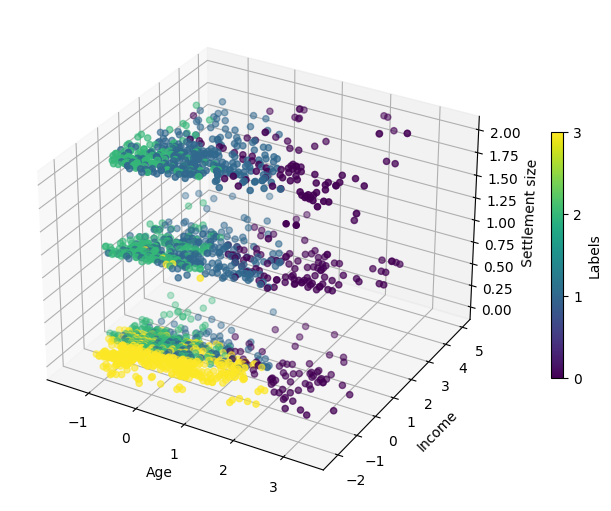
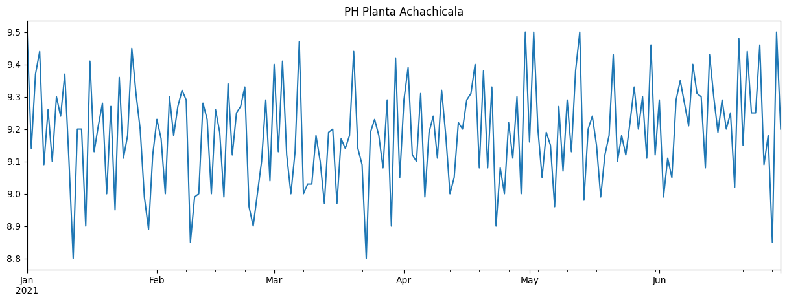
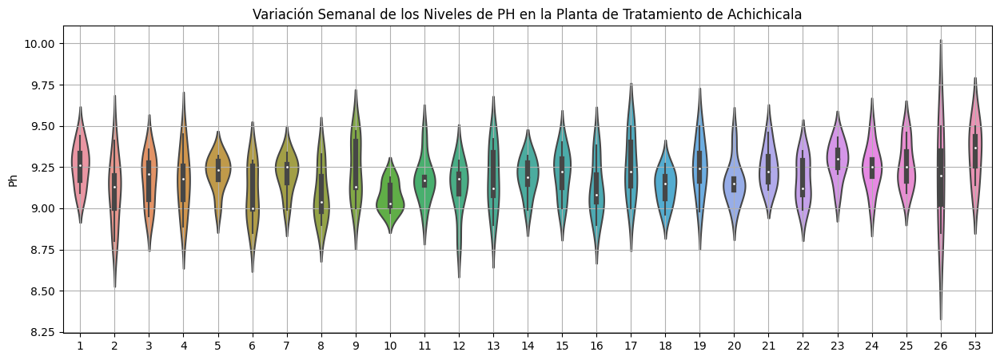
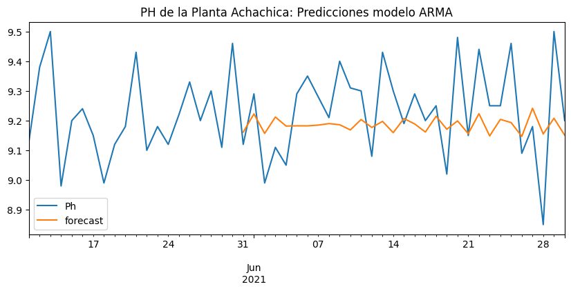

## [Detector de Enfermedades de Plantas](https://github.com/a-jimenezc/plant-disease-app/ "Clic para acceder al repositorio")

* Se construye una página web que permite subir una fotografía de las hojas de una planta y, a partir de esta,  detectar el tipo de hoja y el tipo de enfermedad en la misma. La misma tiene la capacidad de detectar **13 especies** de plantas y hasta **17 enfermedades diferentes**.
* Para tal propósito se usó el algoritmo de detección de objetos [**YOLOv7**](https://arxiv.org/abs/2207.02696) y la implementación open-source hecha por [Wong Kin Yiu](https://github.com/WongKinYiu/yolov7). El algoritmo está implementado en PyThorch, pero la inferencia se realiza usando el formato **ONNX**.
* La página web se desplegó utilizando **Docker** y el servicio *serverless* de **Google Cloud Platfom**: Cloud Run.
* Link al **[repositorio](https://github.com/a-jimenezc/plant-disease-app)** y a la [**página web**](https://plant-disease-app-q3sojgpqiq-uc.a.run.app/).

## [Predictor de Precio de Vivienda: Santa Cruz de la Sierra](https://github.com/a-jimenezc/bienes_raices_scz "Clic para acceder al repositorio")

* Se desarrolló un estimador de precios de viviendas para la ciudad Santa Cruz de la Sierra. El modelo se hace accesible el mediante una aplicación de dash: [bienes-raices-scz-ohh5653uva-uc.a.run.app](https://bienes-raices-scz-q3sojgpqiq-uc.a.run.app/).
* Se utilizó **web scraping** para extraer datos de páginas de venta de viviendas. Se realizó un preprocesamiento de estos datos y un análisis exploratorio de los mismos.
* Se entrenaron varios modelos de regresión, incluyendo **Gradient Boosting Regressor**, y se evaluó su desempeño utilizando **R2** (coeficiente de determinación) como métrica.
* Se implementó una página web interactiva utilizando **Dash**, **Docker** y el servicio **Cloud Run** de Google. En esta, los usuarios pueden estimar el precio de una vivienda.
* En la misma página, se pesenta un **dashboard interactivo** en el cual es posible explorar los datos utilizados en el modelo.
* **[Link al repositorio](https://github.com/a-jimenezc/bienes_raices_scz "Clic para acceder al repositorio")**

* Adicionalmente el modelo es accesible mediante una **API** implmenetada usando **Flask**. [Link al repositorio de la API](https://github.com/a-jimenezc/bienes_raices_scz_api "Clic para acceder al repositorio").

## [ Segmentación de Clientes](https://github.com/a-jimenezc/segmentacion_de_clientes "Clic para acceder al repositorio")

* Se segmentaron a los clientes de un supermercado, usando la información obtenida a través de las tarjetas de membresía del mismo y con la limitación de un reducido número de segmentos.
* Tres algoritmos de agrupamiento distintos fueron evaluados: **K-means, HDBSCAN** y **Gaussian Mixture Model**. Se utilizó la librería **Scikit-learn** para K-means y GMM, mientras que para el algoritmo *HDBSCAN* se utilizó la librería **hdbscan**.
* Para la determinación de los hiperparámetros, se utilizaron las **métricas de la silueta, la inercia** y **BIC** (Bayesian Information Criterion).  
* Luego, se comparó el desempeño de los modelos, usando la métrica de la silueta, y se seleccionó el mejor de ellos.

* El mejor modelo fue **K-means** con cuatro segmentos o grupos (clusters).
* Finalmente, se inspeccionó visualmente el resultado para el mejor modelo y se guardaron los datos con la nueva columna de etiquetas.
* [Link al repositorio](https://github.com/a-jimenezc/segmentacion_de_clientes "Clic para acceder al repositorio")

 

## [ Predicción del PH de la Planta de Tratameinto de Agua Potable Achachicala](https://github.com/a-jimenezc/Prediccion-PH-de-Agua "Clic para acceder al repositorio")

* Se desarrolló un modelo que permita predecir la nivel de PH de la planta de tratamiento de agua Achichicala, ubicada en la ciudad de La Paz, a partir de los datos tomados diariamente en un lapso de 6 meses.
* El primer paso fue realizar una exploración inicial de datos. 

 

* Luego, se probaron tres modelos diferentes. El primero fue un modelo **ARMA**, el segundo un modelo **RNN** (*Recurrent Neural Network*) y el tercero fue un **LSTM** (*Long-Short Term Memory*).
* Finalmente, se seleccionó el modelo **ARMA**. Esto debido a su buen desempeño y simplicidad.
* [Link al repositorio](https://github.com/a-jimenezc/Prediccion-PH-de-Agua "Clic para acceder al repositorio")

 

