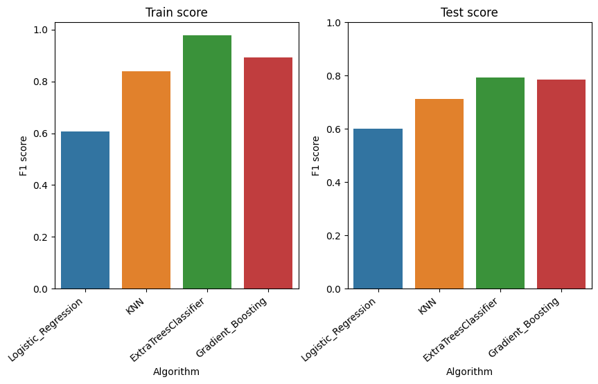

## [ Predicción de Cancelación de Reserva de Hotel](https://github.com/a-jimenezc/Prediccion_cancelacion_reserva_de_hotel "Clic para acceder al repositorio")

* El objetivo del presente trabajo es desarrollar un modelo que permita predecir si un cliente cancelará o no su reservación de hotel. Se prioriza la capacidad de predicción del modelo sobre la explicabilidad.
* En la exploración inicial de datos, se identificaron las variables con mayor correlación con la variable objetivo. Para esto, se utilizó la correlación de Spearman.

* Se entrenaron cuatro modelos diferentes: *Logistic Regression, K-Nearest Neighbor, Extra Tree Classifier* y *Gradient Boosting*. Los hiperparámetros se determinaron con *Grid Search* con *Cross-Validation*, usando la librería Scikit-learn. Se utilizó la métrica *f1* como referencia para esta búsqueda.
* Luego, se hizo la comparación de los modelos para seleccionar el mejor.  

* El algoritmo seleccionado es *Gradient Boosting*, con "learning_rate=1" y "n_estimators=600".
* Una evaluación posterior muestra que este modelo tiene un buen desempeño con las métricas *precision* y *recall*.

## [ Segmentación de Clientes](https://github.com/a-jimenezc/segmentacion_de_clientes "Clic para acceder al repositorio")

* El objetivo del presente trabajo es segmentar a los clientes de un supermercado, usando la información obtenida a través de las tarjetas de membresía del mismo. Se espera un reducido número de segmentos.
* Tres algoritmos de agrupamiento distintos fueron evaluados: *K-means, HDBSCAN* y *Gaussian Mixture Model*. Se utilizó la librería Scikit-learn para K-means y GMM, mientras que para el algoritmo *HDBSCAN* se utilizó la librería hdbscan.
* Para la determinación de los hiperparámetros, se utilizaron las métricas de la silueta, la inercia y *BIC* (Bayesian Information Criterion).  
* Luego, se comparó el desempeño de los modelos, usando la métrica de la silueta, y se seleccionó el mejor de ellos.

* El mejor modelo fue K-means con cuatro segmentos o grupos (clusters).
* Finalmente, se inspeccionó visualmente el resultado para el mejor modelo y se guardaron los datos con la nueva columna de etiquetas.

 

## [ Predicción de Enfermedad Cardiaca con Redes Neuronales](https://github.com/a-jimenezc/Prediccion_de_enfermedad_cardiaca "Clic para acceder al repositorio")

* El objetivo de este proyecto es entrenar una Red Neuronal que permita predecir si un paciente presenta un cuadro de enfermedad de arterias coronarias.
* Para ello, se probaron tres variaciones del algoritmo *MLP* (Multilayer Perceptron): primero con una, luego con dos y finalmente con tres capas ocultas. En cada caso, se utilizó *Grid Seach* con *Cross-Validation* para seleccionar los hiperparámetros. 
* Luego, se comparó el desempeño de cada variación del algoritmo, utilizando la métrica *Accuracy*, y se seleccionó el mejor de ellos. Este fue el modelo con una capa oculta con 35 neuronas.
* Finalmente, se aplicó la técnica de permutación para poder identificar las variables más importantes para el modelo y poder así interpretar el mismo.

  

## Información de Contacto
- Email: [antonio.jimzC@gmail.com](mailto:antonio.jimzC@gmail.com)
- LinkedIn: [www.linkedin.com/in/antonio-jimnzc](https://www.linkedin.com/in/antonio-jimnzc)
- GitHub: [github.com/a-jimenezc](https://github.com/a-jimenezc)

